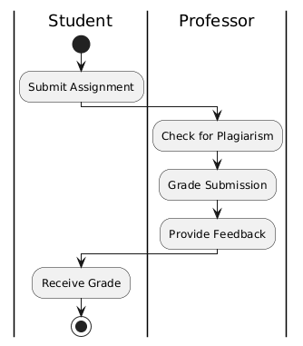
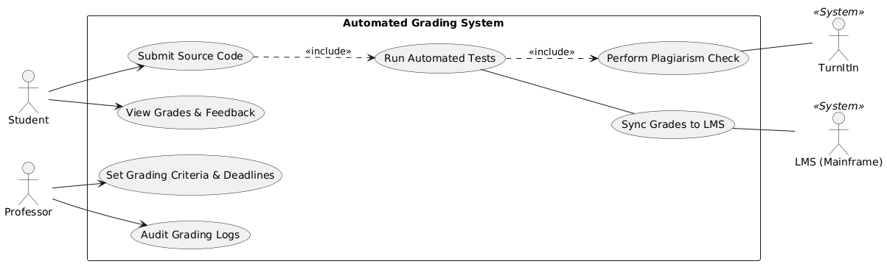
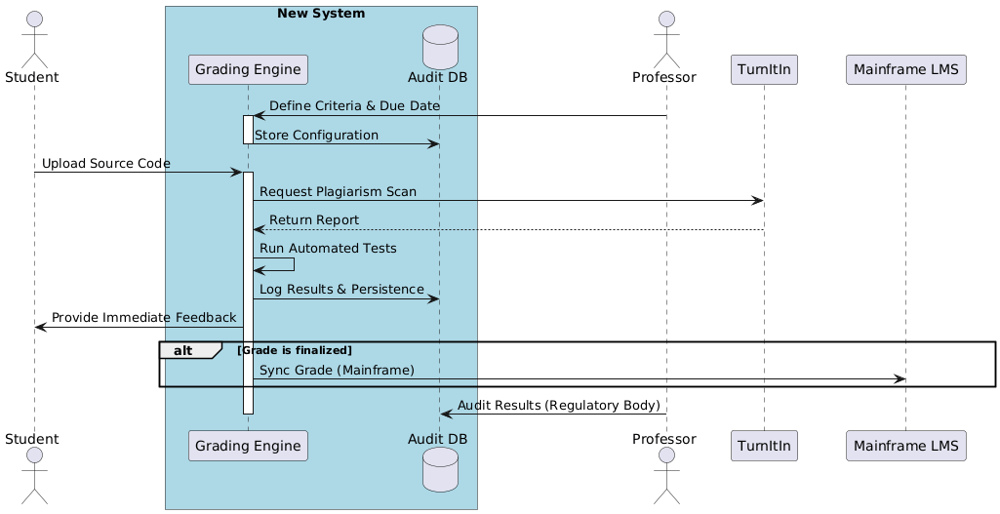

# Automated Grading System: Practical Report

## 1. Introduction

This report explains the design of an Automated Grading System for assignment submission, grading, and feedback. The main actors are the **Student**, the **Professor**, and the **Mainframe LMS (Learning Management System)**.

I developed the report in three steps:

1. Start with a high-level business interaction view.
2. Define system use cases.
3. Show a full system-supported interaction flow.

## 2. Tools Used

I used these tools to plan and document the work:

- **AI Assistants**
    - **DeepSeek**: Helped with structure, writing flow, and technical phrasing.
    - **Claude**: Helped refine use case descriptions and compare interaction alternatives.
- **Diagramming Tool**
    - **PlantText**: Used to draw the IOD and UCD diagrams.

## 3. Diagram 1: Interaction Overview (IOD) - Actor-to-Actor

This first diagram focuses on the business process between people, without going deep into system internals.

Main flow:

1. **Submit Assignment**: Student submits work.
2. **Check for Plagiarism**: Quality and integrity check.
3. **Grade Submission**: Professor evaluates the work.
4. **Provide Feedback**: Professor adds comments.
5. **Receive Grade**: Student gets grade and feedback.

This gives the core outcome: a reviewed and graded assignment returned to the student.

## 4. Diagram 2: Use Case Diagram (UCD)

This diagram defines what the Automated Grading System must do to support the process.

- **Student use cases**
    - **Submit Source Code**
        - `<<include>>` **Run Automated Tests**
        - `<<include>>` **Perform Plagiarism Check**
    - **View Grades & Feedback**

- **Professor use cases**
    - **Set Grading Criteria & Deadlines**
    - **Audit Grading Logs**
        - `<<extends>>` **Sync Grades to LMS** (optional, after final approval)

This model shows the system as a support layer that automates checking and helps both actors complete their tasks.

## 5. Diagram 3: Interaction Overview (IOD) - System-Supported

This final diagram combines the first two views and shows the full interaction sequence.

Process summary:

1. **Professor** defines criteria and due date in the **Auditor DB**.
2. **Student** uploads source code through the **Grading Engine**.
3. **Grading Engine** runs two parallel actions:
     - Sends plagiarism scan request to **Turnitin** and receives the report.
     - Runs automated tests based on stored criteria.
4. **Grading Engine** logs results and gives immediate feedback.
5. **Decision point (grade finalized)**:
     - If not finalized, process continues for review.
     - If finalized, grade is synced to the **Mainframe LMS**.

This view clearly shows how automation, checks, and actor interactions work together.

## 6. Conclusion

This report breaks down the grading workflow from business-level interaction to system-level execution. Together, the three diagrams show a clear progression from concept to implementation view. The design supports module assessment needs by letting professors define criteria while the system handles automated checks, logging, and feedback delivery.